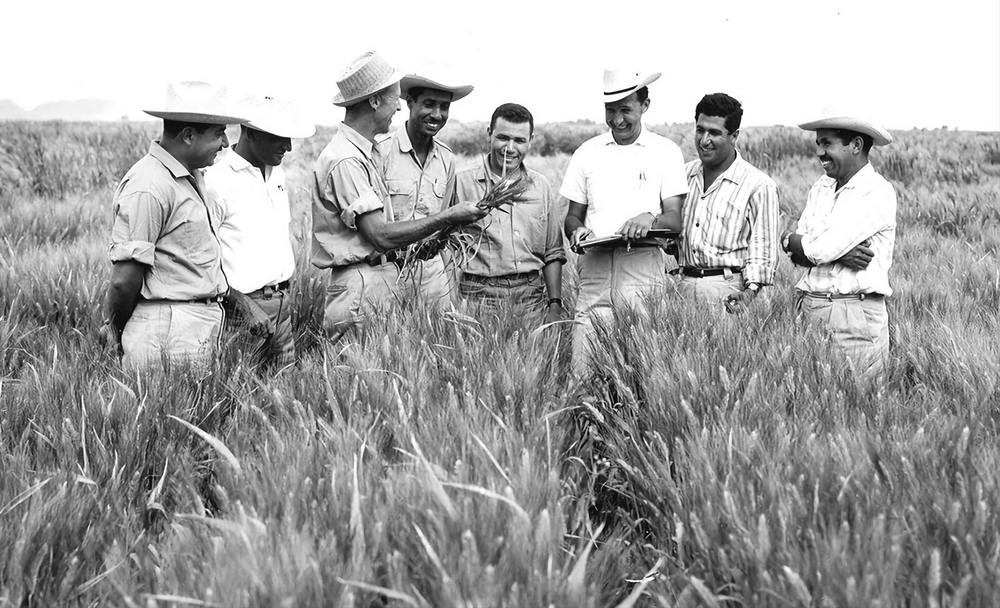

# 🌾 Tribute to Dr. Norman Borlaug  

A simple and elegant HTML/CSS tribute page dedicated to **Dr. Norman Borlaug**, the Nobel Peace Prize laureate known as the *father of the Green Revolution*. He is credited with saving over a billion people from hunger through his groundbreaking work in agricultural science.  

  

---

## 🌟 Features  

- 📜 **Timeline** of Dr. Borlaug’s key life events and accomplishments  
- 🎨 **Custom CSS styling** with a warm and respectful color palette  
- 🖼️ **Image & caption** showcasing Borlaug's field work  
- 🧩 **Clean, semantic HTML5 structure**  

---

## 📚 Sources & Inspiration  

This page was inspired by Dr. Borlaug's work as described by:  

- 📖 [Nobel Prize biography](https://www.nobelprize.org/prizes/peace/1970/borlaug/biographical/)  
- 🌍 [Wikipedia entry](https://en.wikipedia.org/wiki/Norman_Borlaug)  

---

## 🔗 Check It Out!

👉 **Live Demo:**
https://mustafa21102005.github.io/norman-borlaug-biography-page/

Explore the biography page directly in your browser.

---

## 📧 Author

**Mustafa Azmi Khalil**

📬 [Email Me](mailto:mustafa.azmi.khalil@gmail.com)

- 💬 [WhatsApp](https://wa.me/966545117570)
- 👾 [Reddit](https://www.reddit.com/user/mustafa_azmi)

Please feel free to star ⭐ this repo if you find it useful!
