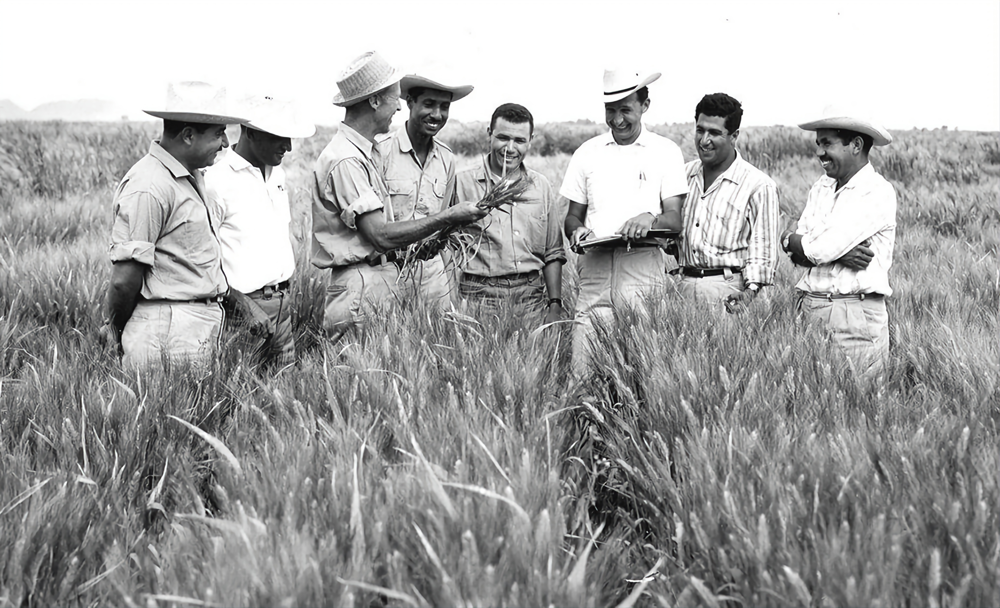

# Tribute to Dr. Norman Borlaug 🌾

This is a simple and elegant HTML/CSS tribute page dedicated to **Dr. Norman Borlaug**, the Nobel Peace Prize laureate known as the *father of the Green Revolution*. He is credited with saving over a billion people from hunger through his groundbreaking work in agricultural science.

## 🌟 Features

- 🧬 Timeline of Dr. Borlaug’s key life events and accomplishments
- 🎨 Custom CSS styling with a warm and respectful color palette
- 📷 Image and caption showcasing Borlaug's field work
- 📝 Clean, semantic HTML5 structure

## 📚 Sources & Inspiration

This page was inspired by Dr. Borlaug's work as described by:

- Nobel Prize biography: https://www.nobelprize.org/prizes/peace/1970/borlaug/biographical/
- Wikipedia entry: https://en.wikipedia.org/wiki/Norman_Borlaug

## 🧑‍🎓 Author

Made by [Mustafa](https://wa.me/966545117570), feel free to reach out for feedback or collaboration!
